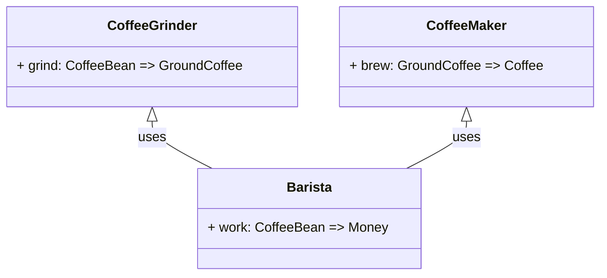
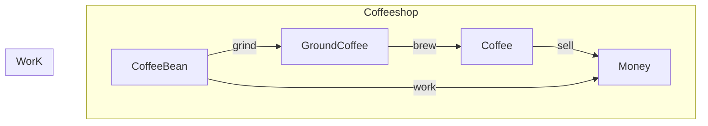

# Alternative dependency injection patterns in Scala

## Requirements

- [scala-cli](https://scala-cli.virtuslab.org/install) 
- [colordiff](https://formulae.brew.sh/formula/colordiff) (optional)

## Domain

- [Models](domain/Models.scala)
- [Interfaces](domain/Interfaces.scala)

### Class Diagram

### Flowchart

## Comparisons

| Link                                 | Run                                          | Comparison with Vanila approach                                |
|--------------------------------------|----------------------------------------------|----------------------------------------------------------------|
| [Vanila approach](docs/Vanila.md)     | `scala-cli ./domain docs/Vanila.md`          | N/A                                                            |
| [Using Guice](docs/Guice.md)          | `scala-cli ./domain docs/Guice.md`           | `colordiff ./docs/Vanila.md ./docs/Guice.md --side-by-side`      |
| [Implicitly](docs/Implicitly.md)      | `scala-cli ./domain docs/Implicitly.md`      | `colordiff ./docs/Vanila.md ./docs/Implicitly.md --side-by-side` |
| [ImplicitlyTyped](docs/ImplicitlyTyped.md) | `scala-cli ./domain docs/ImplicitlyTyped.md` | `colordiff ./docs/Vanila.md ./docs/ImplicitlyTyped.md --side-by-side` |
| [ExplicitlyUsing](docs/ExplicitlyUsing.md) | `scala-cli ./domain docs/ExplicitlyUsing.md` | `colordiff ./docs/Vanila.md ./docs/ExplicitlyUsing.md --side-by-side` |

## Discuss

- Any favorites? Pet peeves?... 
- How would the general approaches introduced here compare, tie in with the established patterns such as:
  - Cat: [Reader](https://typelevel.org/cats/api/cats/data/package$$Reader$.html), [Kleisli](https://typelevel.org/cats/datatypes/kleisli.html); see [here](https://stackoverflow.com/questions/29226560/is-it-just-a-coincidence-that-kleisli-readert-and-reader-are-the-same-in-scala) 
  - Cats MTL: [Ask](https://typelevel.org/cats-mtl/mtl-classes/ask.html)
  - Cake pattern
  - ZIO